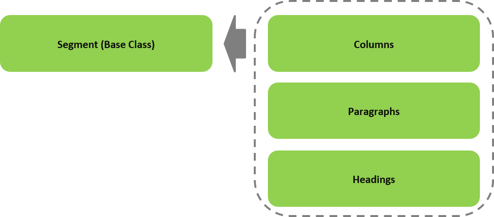

# Gap Framework - Natural Language Processing for PDF/TIFF/Image Documents  

### SEGMENTATION MODULE  

#### High Precision Document Segmentation  
#### Technical Specification, Gap v0.9.2  

### 1.  Segment
#### 1.1  Segment Overview

The segment NLP preprocessor contains the following primary classes, and their relationships:

+ `Segment` - This is the base class for the representation of a Natural Language Processed text segmented into human perceived text layout, such as headings, paragraphs, table columns, etc. The constructor takes as a parameter a text to segment.

```python
segments = Segment(text)
```

  

Fig. 1a High Level view of Segment Class Object Relationships

 
#### 1.2  Segment Initializer (Constructor)

###### Synopsis

```python
Segment(text=None)
```
###### Parameters
>     text : A Unicode text string

###### Usage

When specified without parameters, an empty Segments object is created.

Otherwise, the text sequence is analyzed for region detection based on whitespace surrounding the text.  
Regions include:

+	Headings
+	Paragraphs
+	Page Numbering

###### Exceptions

A `TypeError` is raised if the type of the parameter is not the expected type.

#### 1.3  Segment Properties
##### 1.3.1  segments

###### Synopsis

```python
# Getter
segments = segment.segments			
```

###### Usage

When used as a getter the property returns `REWRITE IN PROGRESS`

#### 1.4  Segment Overridden Operators

##### 1.4.1  len()

###### Synopsis

```python
nsegments = len(segment)
```

###### Usage

The `len()` `(__len__)` operator is overridden to return the number of Image objects in the collection.

##### 1.4.1  []

###### Synopsis

```python
image = images[n] 
```

###### Usage

The `[]` `(__getitem__)` operator is overridden to return the segment at the specified index. 

###### Exceptions

A `IndexError` is raised if the index is out of range.

#### 1.5  Segment Private Methods

The segment class contains the following private methods:

+ `_segmentation()` – This method is called by the constructor. It parses the text to identify text layouts, such as headings, paragraphs, columns, page numbering, etc, and separates the text into segments according to the identified layout.

#### 1.6  Segment Public Methods

The Segment class contains of following public methods:

+ There are no public methods. 

---
### APPENDIX I: Updates

Pre-Gap (Epipog) v1.4
+	An initial prototype was built

Gap v0.91 (alpha)
+	Rewrite of Specification 

### APPENDIX II: Anticipated Engineering

The following has been identified as enhancement/issues to be addressed in subsequent update:

1.  Add support for splitting dual column pages.

Proprietary Information
Copyright ©2018, Epipog, All Rights Reserved
