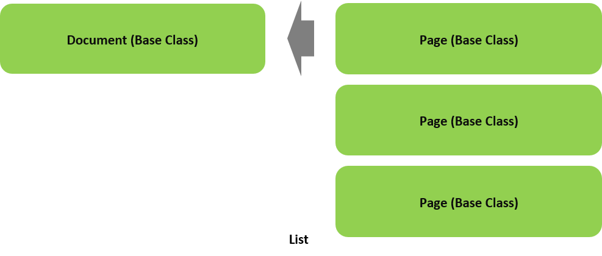

# Natural Language Processing for PDF/TIFF/Image Documents 
## Computer Vision for Image Data

## SPLITTER Module
High Precision PDF Page Splitting/OCR/Text Extraction
Technical Specification, Gap v0.91

## 1.  Document
### 1.1  Document Overview

The document classifier contains the following primary classes, and their relationships:

+ **Document** – This is the base class for the representation of a stored document.  The constructor for the class object takes as parameters the stored path to the document, optionally a directory path for storing extracted pages and text, and optionally an event completion handler when processing the document asynchronously, and optionally a config parameter for configuring the NLP preprocessing.

```python
document = Document(“/somedir/mydocument.pdf”, “/mypages/mydocument”)
```

The constructors calls the `_exists()` and `_collate()` private methods for the specified document.

+ **Page** – This is a base class for the representation of an extracted page from the document. The `Document` class contains a list (index) of the extracted pages as `Page` objects.

  

Fig. 1a High Level view of `Document` Class Object Relationships

### 1.2  Initializer (Constructor)

###### Synopsis

```python
Document( document=None, dir=’./’, ehandler=None,  config=None)
```

###### Parameters

**document:**   If not None, a string that is either:

>     1. local path to document
>     2. remote path to document ((i.e., http[s]://….)
>     The document must be one of the following types: PDF. JPG, PNG, BMP or TIF

**dir:**    The directory where to store the machine learning ready data.

**ehandler:**   If not None, the processing of the images into machine learning ready data will be asynchronous, and the value of the parameter is the function (or method) that is the event handler when processing is complete. The event handler takes the form:

```python
def myHandler(images): 
    # where images is the Images object that was preprocessed.
```

**config:** If not None, a list of one or more configuration settings as strings:

>     bare
>     pos
>     roman
>     segment
>     stem=gap|porter|Lancaster|snowball|lemma

###### Usage

When specified with no parameters, an empty `Document` object is created. The `Document` object may then be used to subsequent load (retrieve) previously stored preprocessed machine learning ready data (see `load()`).

Otherwise, the document parameter must be specified.

The document specified by the document parameter will be preprocessed according to the optional parameters and configuration settings.

By default, the document will be preprocessed as follows:

1.	The document will be split into individual pages.
2.	A `Page` object will be created for each page.
3.	If the document (or page) is an image (e.g., scanned PDF), it will be OCR’d.
4.	The digital text will be extracted from each page and stored in the `Page` object.
5.	The text will be optionally segmented into regions if the configuration setting segment is specified.
6.	The text from each page object will be preprocessed into machine learning ready data (see syntax module specification), according to the optional parameters and configuration settings.
7.	If the document was a scanned or image document, the quality of the scan will be estimated, unless `Document.SCANCHECK` is set to zero.

The machine learning ready data will be stored on a per page basis in the directory specified by the parameter dir. The following files are created and stored:

>     <document><pageno>.<suffix>
>     <document><pageno>.txt
>     <document>.<pageno>.json

The `<document>` is the root name of the document, and `<pageno>` is the corresponding page number starting at page 1. The file ending in the original file suffix `<suffix>` is the split page. The file ending in the file suffix `.txt` is the extracted text. The file ending in the file suffix `.json` is the NLP preprocessed machine learning data stored in a JSON format.

If the ehandler parameter is not None, then the above will occur asynchronously, and when completed, the corresponding event handler will be called with the `Document` object passed as a parameter.

If the path to the document file is remote (i.e., starts with http), an HTTP request will be made to fetch the contents of the file from the remote location.

###### Exceptions

A `TypeError` is raised if the type of the parameter is not the expected type.  
A `AttributeError` is raised if an invalid configuration setting is specified.  
A `FileNotFoundError` is raised if the document file does not exist.  
A `IOError` is raised if an error occurs reading in the document file.

### 1.3  Document Properties

#### 1.3.1  document

###### Synopsis

```python
# Getter
path = document.document

# Setter
document.document = path	
```

###### Usage

When used as a getter the property returns the path to the document file.  
When used as a setter the property specifies the path of the document file to preprocess into machine learning ready data (see initializer).

###### Exceptions

A `TypeError` is raised if the type of the parameter is not the expected type.  
A `FileNotFoundError` is raised if the document file does not exist.  
A `IOError` is raised if an error occurs reading in the document file.

#### 1.3.2	name

###### Synopsis

```python
# Getter
root = document.name
```

###### Usage

When used as a getter the property returns the root name of the document file (e.g., /mydir/mydocument.pdf -> mydocument).

#### 1.3.3  type

###### Synopsis

```python
# Getter
suffix = document.type
```

###### Usage

When used as a getter the property returns the file suffix of the document file (e.g., pdf).

#### 1.3.4  size

###### Synopsis

```python
# Getter
size = document.size
```

###### Usage

When used as a getter the property returns the file size of the document file in bytes.

#### 1.3.5  dir

###### Synopsis

```python
# Getter
subfolder = document.dir

# Setter
document.dir = subfolder	
```

###### Usage

When used as a getter the property returns the directory path where the corresponding files of the associated page objects are stored.
When used as a setter, it is only applicable when used in conjunction with the `load()` method, indicating where the path where the files associated with the page objects are stored. Otherwise, it is ignored.

###### Exceptions

A `TypeError` is raised if the type of the parameter is not the expected type.  
A `FileNotFoundError` is raised if the directory does not exist.

#### 1.3.6  label

###### Synopsis

```python
# Getter
label = document.label

# Setter
document.label = label	
```

###### Usage

When used as a getter the property returns the `integer` label specified for the document.
When used as a setter the property sets the label of the document to the specified integer value.

###### Exceptions

A `TypeError` is raised if the type of the parameter is not the expected type.

#### 1.3.7  scanned

###### Synopsis

```python
# Getter
scanned, quality = document.scanned
```

###### Usage

When used as a getter the property returns whether the document is a scanned image `True` or digital text `False` document, and the estimated quality of the scan as a percentage (between 0 and 1).

#### 1.3.8  time

###### Synopsis

```python
# Getter
secs = document.time
```

###### Usage

When used as a getter the property returns the amount of time (in seconds) it took to preprocess the document into machine learning ready data.

#### 1.3.9  text

###### Synopsis

```python
# Getter
text = document.text
```

###### Usage

When used as a getter the property returns a list, one entry per page, of the extracted text from the document in its original Unicode format.

#### 1.3.10  pages

###### Synopsis

```python
# Getter
pages = document.pages
```

#### 1.3.11  bagOfWords

###### Synopsis

```python
# Getter
bag = document.bagOfWords	
```

###### Usage

When used as a getter the property returns the document’s word sequences as a Bag of Words, represented as an unordered dictionary, where the key is the word and the value is the number of occurrences:

>     { ‘<word’> : <no. of occurrences>, … }

#### 1.3.12  freqDist

###### Synopsis

```python
# Getter
freq = document.freqDist	
```

###### Usage

When used as a getter the property returns the sorted tuples of a frequency distribution of words (from bag of words), in descending order (i.e., highest first)

>     [ ( ‘<word’>: <no.  of occurrences> ), …. ]

#### 1.3.13  termFreq

###### Synopsis

```python
# Getter
tf = document.termFreq
```

###### Usage

When used as a getter the property returns the sorted tuples of a term frequency distribution (percent that term occurs), in descending order (i.e., highest first)

>     [ ( ‘<word’>: <percentage  of occurrences> ), …. ]

#### 1.3.14  Static Variables

The Document class contains the following static variables:

+	**RESOLUTION** – The image resolution when converting `PDF` to `PNG` for `OCR` (default `300`).  
+	**SCANCHECK**  – The number of `OCR` words to check to estimate the quality of the scan.  
+	**WORDDICT**   - The word dictionary to use for scan spell check (default to `pyaspeller`).

### 1.4  Document Overridden Operators

#### 1.4.1  len()

###### Synopsis

```python
npages = len(document)
```

###### Usage

The `len()` `(__len__)` operator is overridden to return the number of pages in the document.

#### 1.4.2	+=

###### Synopsis

```python
document += page
```

###### Usage

The `+=` `(__iadd__)` method is overridden to append a Page object to the document.

#### 1.4.3  []

###### Synopsis

```python
page= documents[n] 
document[n] = page
```

###### Usage

The `[]` `(__getitem__)` operator is overridden to return the Page object at the specified index.  
The `__setitem__()` method is overridden to replace the Page object at the specified index (i.e., page number – 1).

###### Exceptions

A `IndexError` is raised if the index is out of range.

#### 1.4.4  str()

###### Synopsis

```python
label = str(image)
```

###### Usage

The `str()` `(__str__)` operator is overridden to return the label of the document as a string.

### 1.5  Document Public Methods

#### 1.5.1  load()

###### Synopsis

```python
document.load(name, dir=None) 
```

###### Parameters

**name:** The name of the document. 

###### Usage

This method will load into memory a preprocessed machine learning ready data from the corresponding JSON files specified by the document (root) name. The method will load the JSON files by the filename `<name><pageno>.json`. If `dir` is `None`, then it will look for the files where the current value for dir is defined (either locally or reset by the dir property). Otherwise, it will look for the files under the directory specified by the dir parameter.

Once loaded, the `Document` object will have the same characteristics as when the `Document` object was created.

###### Exceptions

A `TypeError` is raised if the type of the parameter is not the expected type.  
A `ValueError` is raised if the name parameter is `None`.

### 1.6  Document Private Methods

The `Document` class contains the following private methods:

+ `_exists()` – This method checks if the document exists at the specified stored path. If not, a `FileNotFound` exception is thrown.

+ `_collate()` – This method performs the collation task, which includes:

   - Determines the number of pages in the document.
   
   - Splits the document into individual pages, where each page is individually stored in the same format as the document. The pages are named as follows:
   
       `<name><pageno>.<suffix>`
   
       Each page is stored in the subdirectory specified by the property dir. If dir is None, then the page is stored in the same directory where program is ran; otherwise, if the subdirectory does not exist, it is created.
    - If the page is a scanned PDF page, the scanned image is extracted and saved as a PNG image. The PNG image is then OCR’d to convert to text.
    
       `<name><pageno>.png`
   
    - If the page is a TIFF facsimile, the TIFF image is then OCR’d to convert to text.
    
       `<name><pageno>.tif`
   
    - If the page is an image capture (e.g. camera capture), the captured image (e.g., JPG) is then OCR’d to convert to text.
    
       `<name><pageno>.jpg`
   
    - Extracts the raw text from the page , where each page is individually stored in a raw text format. The pages are named as follows:
    
       `<name><pageno>.txt`
   
       Each page is stored in the subdirectory specified by the property dir. If dir is None, then the page is stored in the same directory where program is ran.
   
    - Create a Page object for each page and adds them to the pages index property.
    
    - If the document format is raw text, then:  
        * Treats as a single page.  
        * Stores only a single page text file.
        
    - If the document format is PDF, then page splitting and extraction of the raw text per page is done with the open source version of Ghostscript. If the document is a scanned PDF, the image is extracted and converted to PNG using Ghostscript and then OCR’d using open source Tesseract.
    
   - If the document format is TIFF, then page splitting is done with the open source Magick and then OCR’d using open source Tesseract.

+ `_scancheck()` – This method is called after NLP preprocessing of the document has been completed, and the document was a scanned image. The method will sample upto `SCANCHECK` number of words for recognition in a English dictionary (i.e., pyaspeller). The method will check the words on either page 1 or page 2, depending on which page has a greater number of words. Punctuation, symbols, acronyms or single letter words are excluded. The method then sets the internal variable _quality to the percentage of the words that were recognized (between 0 and 1).

+ `_async()` – This method performs asynchronous processing of the `_collate()` function, when the optional ehandler parameter to the constructor is not `None`. When processing is completed, the ehandler parameter value is called as a function to signal completion of the processing, and the document object is passed as a parameter.

---
## 2.  Page

### 2.1  Page Overview

The page classifier contains the following primary classes, and their relationships:

+ `Page` – This is a base class for the representation of an extracted page from a document.  The constructor for the class object takes optionally as parameters the stored path to the page, and the extracted raw text. 

```python
page = Page( ‘/mypages/page1.pdf’, ‘some text’)
```
+ `Words` – This is a base class for representation of the text as NLP preprocessed list of words.

  

Fig. 2a High Level view of Page Class Object Relationships

### 2.2  Page Initializer (Constructor)

###### Synopsis

```python
Page( page=None, text=None,  pageno=None)
```

###### Parameters

**page:**   If not None, the local path to the page.  
**text:**   If not None, the text corresponding to the page.  
**pageno:** If not None, the page number in the corresponding Document object.

###### Usage

If the text parameter is not None, a `Words` object is created and instantiated with the corresponding text. The text is then NLP preprocessed according to the configuration settings stored as static members in the Page class (i.e., set by the parent Document object):

`BARE`	: If True, then the bare configuration setting is passed to the Words object.  
`STEM`	: If not None, then the stem configuration setting is passed to the Words object.  
`ROMAN`: If True, then the roman configuration setting is passed to the Words object.  
`POS`	: If True, then the pos configuration setting is passed to the Words object.

###### Exceptions

A `TypeError` is raised if the type of the parameter is not the expected type.  
A `FileNotFoundError` is raised if the file specified by page parameter does not exist.

### 2.3  Page Properties

#### 2.3.1  path

###### Synopsis

```python
# Getter
path = page.path

# Setter
page.path= path	
```

###### Usage

When used as a getter the property returns the path of the corresponding page (i.e., split by Document object) in its native format.

When used as a setter the property sets the path of the corresponding split page.

###### Exceptions

A `TypeError` is raised if the type of the parameter is not the expected type.  
A `FileNotFoundError` is raised if the file specified by path does not exist.

#### 2.3.2  pageno

###### Synopsis

```python
# Getter
pageno = page.pageno
```

###### Usage

When used as a getter the property returns the pageno set for the `Page` object in the corresponding parent `Document` object.

#### 2.3.3  size

###### Synopsis

```python
# Getter
nbytes = page.size
```

###### Usage

When used as a getter the property returns the byte size of the text parameter.

#### 2.3.4  label

##### Synopsis

```python
# Getter
label = page.label

# Setter
page.label = label
```

###### Usage

When used as a getter the property returns the `integer` label that has been assigned to the page.

When used as a setter the property assigns `sets` a label to the page.

###### Exceptions

A `TypeError` is raised if the type of the parameter is not the expected type.

#### 2.3.5  words

Synopsis

```python
# Getter
words = page.words
```

###### Usage

When used as a getter the property returns the Words object of the corresponding NLP preprocessed text.

#### 2.3.6  bagOfWords

###### Synopsis
```python
# Getter
bag = page.bagOfWords	
```

###### Usage

When used as a getter the property returns the page’s word sequences as a Bag of Words, represented as an unordered dictionary, where the key is the word and the value is the number of occurrences:

>     { ‘<word’> : <no. of occurrences>, … }

#### 2.3.7  freqDist

###### Synopsis

```python
# Getter
freq = page.freqDist	
```

###### Usage

When used as a getter the property returns the sorted tuples of a frequency distribution of words (from bag of words), in descending order (i.e., highest first)

>     [ ( ‘<word’>: <no.  of occurrences> ), …. ]

#### 2.3.8  termFreq

###### Synopsis

```python
# Getter
tf = page.termFreq
```

###### Usage

When used as a getter the property returns the sorted tuples of a term frequency distribution (percent that term occurs), in descending order (i.e., highest first)

>     [ ( ‘<word’>: <percentage  of occurrences> ), …. ]

#### 2.3.9  Static Variables

The Page class contains the following static variables:

`BARE`	: If True, then the bare configuration setting is passed to the Words object.  
`STEM`	: If not None, then the stem configuration setting is passed to the Words object.  
`ROMAN` : If True, then the roman configuration setting is passed to the Words object.  
`POS`	  : If True, then the pos configuration setting is passed to the Words object.

### 2.4  Page Overwritten Operators

#### 2.4.1  len()

###### Synopsis

```python
nwords = len(pages)
```

###### Usage

The `len()` `(__len__)` operator is overridden to return  the number of NLP tokenized words in the page.

#### 2.4.2	+=

###### Synopsis

```python
page += text
```

###### Usage

The `+=` `(__iadd__)` method is overridden to append text to the page, which is then NLP preprocessed.

###### Exceptions

A `TypeError` is raised if the type of the parameter is not the expected type.

#### 2.4.3  str()

###### Synopsis

```python
label = str(image)
```

###### Usage

The `str()` `(__str__)` operator is overridden to return the label of the page as a string.

### 2.5  Page Private Methods

The Page class contains no private methods.
 
### 2.6  Page Public Methods

#### 2.6.1 `store()`

###### Synopsis

```python
image.store(path)
```

###### Parameters

**path:** the file path to write to.

###### Usage

The `store()` method writes the NLP tokenized sequence as a JSON object to the specified file.

Exceptions

A `TypeError` is raised if the type of the parameter is not the expected type.  
A `FileNotFoundError` is raised if the file path is invalid.

#### 2.6.2  load()

###### Synopsis

```python
image.load(path) 
```

###### Parameters

**path:** the file path to read from.

###### Usage

The `load()` method writes the NLP tokenized sequence as a JSON object from the specified file.

###### Exceptions

A `TypeError` is raised if the type of the parameter is not the expected type.  
A `FileNotFoundError` is raised if the file path is invalid.

---
## APPENDIX I: Updates

**Pre-Gap (Epipog) v1.1**
1.	Added time property.
2.	Added scanned property.
3.	Added support for TIFF and JPG/PNG.

**Pre-Gap (Epipog) v1.3**
1.	Add direct read of PDF resource element to determine if scanned page.
2.	Fix not detecting scanned PDF if text extraction produced noise.

**Pre-Gap (Epipog) v1.4**
1.	Added pageno property to `Page` class.
2.	Added methods `store()` and `load()` to Page class to store/load NLP tokenized words to file.
3.	Added method `load()` to `Document` class to reload NLP tokenized words from storage.
4.	Added config keyword arguent to `Document` initializer to configure NLP preprocessing.

**Pre-Gap (Epipog) v1.5** 
1.	Added `bagOfWords`, `freqDist`, and `termFreq` properties to `Document` and `Page` class.

**Gap v0.91 (alpha)**
1.	Rewrote Specification
2.	Add `OCR` quality estimate

## APPENDIX II: Anticipated Engineering

The following has been identified as enhancement/issues to be addressed in subsequent update:
1.	What does it mean to add text to a document.  
2.	Break raw text into pages for > 50 lines  
3.	Refactor page counting for faster performance
4.	Add page split endpoint for streaming interface and URL
5.	Add more pdf test files
6.	Fix bug of not handling Cryllic characters in page `load()` method.

Proprietary Information
Copyright ©2018, Epipog, All Rights Reserved
