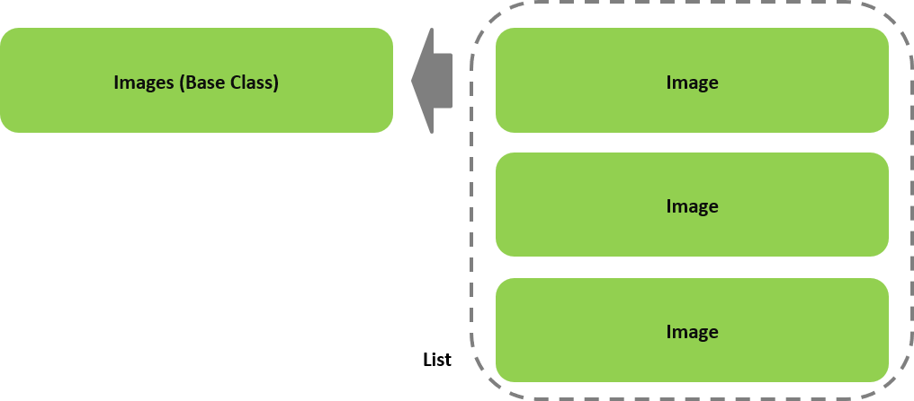

# <span style='color:saddlebrown'>Gap</span> Framework - Computer Vision for Image Data

## VISION MODULE
High Precision Image Processing  
Technical Specification, Gap v0.9.3

## 1 Images
### 1.1 Images Overview

The Images CV preprocessor contains the following primary classes, and their relationships:

+ **Images** - This is the base class for the representation of a Computer Vision (CV) preprocessed list of images. The constructor optionally takes as parameters a list of images (paths), and corresponding labels, and flags for CV preprocessing the images into machine learning ready data.

```python
images = Images([<list of images>], [<list_of_labels>], flags …)
```
    Alternately, the list of images can be a list of directories which contain images.
    Alternately, the list of images can be a list of URLs of remotely stored images.
    Alternately, the list of labels maybe a single value; in which case, the label applies to all the images.

+ **Image** – This is the base class for the representation of a single Computer Vision (CV). The constructor optionally takes as parameters an image (path), corresponding label, and flags for CV preprocessing the image.

    Alternately, the image can be an URL of a remotely stored image.

  

Fig. 1a High Level view of `Images` Class Object Relationships

### 1.2 Images Initializer (Constructor)

**Synopsis**

```python
Images(images=None, labels= None, dir=’./’, name=None, ehandler=None,  config=None)
```

**Parameters**

**images:** If not None, a list of either:  
1.	local image files  
2.	remote image files (i.e., http[s]://….)  
3.	directories of local image files.

**labels:** If not None, either:  
1.	A single integer value (i.e., label) which corresponds to all the images.  
2.	A list of the same size as images parameter list of integer values; where the index of each value is the label for the corresponding index in the images parameter.

**dir:** The directory where to store the machine learning ready data.

**name:** If not None, a name (string) for the collection.

**ehandler:** If not None, the processing of the images into machine learning ready data will be asynchronous, and the value of the parameter is the function (or method) that is the event handler when processing is complete.

The event handler takes the form:

```python
def myHandler(images): 
 	 	# Where images is the Images object that was preprocessed.
```

**config:** If not None, a list of one or more configuration settings as strings:

        grayscale               | gray  
        flatten                 | flat  
        resize=(height,width)   | resize=height,width  
        thumb=(height,width)    | thumb=height,width  
	float=float16		| float32 | float64
    	nostore
	raw
			
**Usage**

When specified with no parameters, an empty `Images` object is created. The `Images` object may then be used to subsequent load (retrieve) previously stored preprocessed machine learning ready data (see `load()`).

Otherwise, both `images` and `labels` parameters must be specified. The `labels` parameter corresponds to the labels of the images. Each image specified by the `images` parameter will be preprocessed according to the optional parameters and configuration settings (i.e., `config` parameter).

By default, the images will be preprocessed as follows:

1.	An `Image` object is created for each image.
2.	The `config` parameter passed to the `Image` initializer (constructor) will have the ‘nostore’ setting, which instructs each `Image` object to not separately store the generated preprocessed machine learning ready data.
3.	Upon completion, the preprocessed machine learning data for each image is stored as a single HDF5 file in the current working directory, unless the `config` parameter 'nostore' was specified. The root name of the file will be the root name of the first image, preprended with 'collection'. For example, if the first image was `cat.jpg`, then the root name of the HDF5 will be:

```
collection.cat.h5
```

If either or both the `dir` and `config` options are not `None`, they are passed down to each `Image` object.

If the `name` parameter is specified, the value will be the root name of the HDF5 stored file.

If the `ehandler` parameter is not `None`, then the above will occur asynchronously, and when completed, the corresponding event handler will be called with the `Images` object passed as a parameter. The `ehandler` parameter may also be specified as a tuple, where the first item in the tuple is the event handler and the remaining items are arguments to pass to the event handler.

If the path to an image file is remote (i.e., starts with http), an HTTP request will be made to fetch the contents of the file from the remote location.

**Exceptions**

A `TypeError` is raised if the type of the parameter is not the expected type.  
A `AttributeError` is raised if an invalid configuration setting is specified.  
A `IndexError` is raised if the size of the labels list does not match the size of the images list.

### 1.3 Images Properties

#### 1.3.1 dir

**Synopsis**

```python
# Getter
path = images.dir

# Setter
images.dir = path			
```

**Usage**

When used as a getter, the property returns the path where the HDF5 file is stored.

When used as a setter, it is only applicable when used in conjunction with the `load()` or `store()` methods, indicating where the path where the HDF5 file is found. Otherwise, it is ignored.

**Exceptions**

A `TypeError` is raised if the type of the parameter is not the expected type.  
A `FileNotFoundError` is raised if the directory does not exist.

#### 1.3.2 name

**Synopsis**

```python
# Getter
collection = images.name
```

**Usage**

When used as a getter the property returns the root name of the HDF5 stored file (also referred to as the name of the collection).

#### 1.3.3 images

**Synopsis**

```python
# Getter
images = images.images
```

**Usage**

When used as a getter the property returns the list of Image objects generated for the collection.

#### 1.3.4 labels

**Synopsis**

```python
# Getter
labels = images.labels
```

**Usage**

When used as a getter the property returns the label or list of labels for the collection.

#### 1.3.5 time

**Synopsis**

```python
# Getter
secs = images.time
```

**Usage**

When used as a getter the property returns the amount of time (in seconds) it took to preprocess the collection into machine learning ready data.
 
#### 1.3.6 split

**Synopsis**

```python
# Getter
x_train, x_test, y_train, y_test = images.split

# Setter
images.split = percent [,seed]		
```

**Usage**

When used as a setter, a training and test dataset is generated. The `percent` parameter specifies the percent that is test data. The data is first randomized before the split. By default, the seed for the split is `0`. A seed may be optional specified as a second value.  

When repeated, the property will re-split the data and re-randomize it.  

When used as a getter, the split training, test, and corresponding labels are returned as lists converted to numpy arrays, and the labels are one-hot encoded. This is typically used in conjunction with `next()` operator or `minibatch` property.  

When the percent is `0`, the data is not split. All the data will be returned in `x_train` and `y_train`, but will still be randomized; `x_test` and `y_test` will be `None`.

**Exceptions**

A `TypeError` is raised if the type of the parameter is not the expected type.  
A `ValueError` is raised if a parameter is out of range.  
A `AttributeError` is raised if the number of parameters passed to the setter property is incorrect.

#### 1.3.7 minibatch

**Synopsis**

```python
# Getter
generator = images.minibatch

# Setter
images.minibatch = batch_size		
```

**Usage**

When used as a setter, the mini-batch size is set.

When used as a getter, a generator is returned. The generator will iterate sequentially through the mini-batches of the training set.  

If the `augment` property is set to True, for each image in the training set, an additional image is generated by rotating the image a random value between -90 and 90 degrees. Thus, if the mini-batch size is 100 images, the `minibatch` getter will build a generator for 200 images. See `augment` for more variations of image augmentation.

**Exceptions**

A `TypeError` is raised if the type of the parameter is not the expected type.  
A `ValueError` is raised if the batch_size is out of range.

#### 1.3.8 augment

**Synopsis**

```python
# Getter
augment = images.augment

# Setter
images.augment = True | False

images.augment = (min, max[, n])
```

**Usage**

When used as a setter and set to `True`, image augmentation for rotation is enabled during batch generation (see `minibatch` and `next()`). In this mode, for each image, an additional image will be generated that is randomly rotated between -90 and 90 degrees.

When used as a setter and set to a tuple, the min and max boundaries for degree rotation are specified, and optionally the number of augmented images to generate per original image.

When used as a getter, the property returns whether image augmentation is enabled.

The parameter to the `augment` property may also be a tuple. The tuple specifies the rotation range and optionally the number of agumented images to generate per image; otherwise defaults to one. In the example below:

**Exceptions**

A `TypeError` is raised if the type of the parameter is not the expected type.

#### 1.3.9 flatten

```python
images.flatten = True | False
```

**Usage**

When used as a setter and set to `True`, the machine learning ready data is flatten to a 1D vector.

When used as a setter and set to `False`, the machine learning ready data is unflatten back to a 2D (gray) or 3D (color) matrix.

**Exceptions**

A `TypeError` is raised if the type of the parameter is not the expected type.

#### 1.3.10 resize

```python
images.resize = (height, width)
```

**Usage**

When used as a setter, the machine learning ready data is resized to the specified height and width.

**Exceptions**

A `TypeError` is raised if the type of the parameter is not the expected type.

### 1.4 Images Overridden Operators

#### 1.4.1 len()

**Synopsis**

```python
n_images = len(images)
```

**Usage**

The `len()` `(__len__)` operator is overridden to return the number of `Image` objects in the collection.

### 1.4.2 []

**Synopsis**

```python
image = images[n] 
```

**Usage**

The `[]` `(__getitem__)` operator is overridden to return the Image object at the specified index. 

**Exceptions**

A `IndexError` is raised if the index is out of range.

#### 1.4.3 next()

**Synopsis**

```python
data, label = next(images) 
```

**Usage**

The `next()` operator is overridden and is used in conjunction with the split property. Once the collection has been split in training and test data, the `next()` operator will iterate through the training dataset one image, and corresponding label, at a time.

Once the training set has been fully iterated, the `next()` operator returns `None`, and will reset and start with the first element.  Additionally, the training set will be randomly reshuffled.

If the `augment` property is not False, for each image in the training set, one or more additional images are generated by rotating the image a random value between -90 and 90 degrees. For example, for a training set of a 1000 images, if the parameter to the property `augment` is True, the `next()` operator will iterate through 2000 images. If the parameter was a tuple and the number of augmentations per image was set to 2, the `next()` operator will iterate through 3000 images.

#### 1.4.4 +=

**Synopsis**

```python
images += image

images += images2
``` 

**Parameters**

**image:** A single `Image` object

**images2:** A single `Images` object (i.e., collection of `Image` objects).

**Usage**

The `[]` `(__iadd__)` operator is overridden to either add a single `Image` object or a `Images` object (i.e., collection) to an existing `Images` object. If the configuration setting 'nostore' is set for the parent `Images` object, the updated Images object is not stored to the corresponding HDF5 file, in which case one must explicity issue the `store()` method; otherwise ('nostore' is not set), the updated `Images` object is stored to the corresponding HDF5 file.
 
**Exceptions**

A `TypeError` is raised if the type of the parameter is not the expected type.  

### 1.5 Images Public Methods

#### 1.5.1 load()

**Synopsis**

```python
images.load(name, dir=None) 
```

**Parameters**

**name:** The name of the collection. 

**Usage**

This method will load into memory a preprocessed machine learning ready data from an HDF5 file specified by the collection name. The method will load the HDF5 by the filename `<collection>.h5`. If `dir` is None, then it will look for the file where the current value for `dir` is defined (either locally or reset by the `dir` property). Otherwise, it will look for the file under the directory specified by the `dir` parameter.
	
Once loaded, the `Images` object will have the same characteristics as when the `Images` object was created.

**Exceptions**

A `TypeError` is raised if the type of the parameter is not the expected type.  
A `ValueError` is raised if the name parameter is None.

#### 1.5.2 store()

**Synopsis**

```python
images.store() 
```

**Usage**

This method will store the machine learning ready data (and corresponding metadata) in a HDF5 file. 
 
## 2 Image

### 2.1 Image Overview

The Image CV preprocessor contains the following primary classes, and their relationships:

+ Image - This is the base class for the representation of a Computer Vision (CV) preprocessed image. The constructor optionally takes as parameters an image (path), and corresponding label, and flags for CV preprocessing of the image.

```python
image = Image(<image_path>, <label>, flags …)
```

The image path maybe a local path or an URL to a remote location, or raw pixel data as a numpy array. For remote location, a HTTP request is made to obtain the image data.

### 2.2 Image Initializer (Constructor)

**Synopsis**

```python
Image(image=None, label= 0, dir=’./’, ehandler=None,  config=None)
```

**Parameters**

**image:** If not None, a string of either:  
1.	local path to an image file  
2.	remote location of an image file (i.e., http[s]://….)  
3.	raw pixel data as a numpy array

**label:** An integer value which is the label corresponding to the image.

**dir:** The directory where to store the machine learning ready data.

**ehandler:** If not None, the processing of the images into machine learning ready data will be asynchronous, and the value of the parameter is the function (or method) that is the event handler when processing is complete. The event handler takes the form:

```python
def myHandler(image, dir): 
 	# Where image is the Image object that was preprocessed.
```

**config:** If not None, a list of one or more configuration settings as strings:  
            grayscale               | gray  
            flatten                 | flat  
            resize=(height,width)   | resize=height,width  
            thumb=(height,width)    | thumb=height,width  
	    float=float16	    | float32 | float64
            nostore
	    raw

**Usage**

When specified with no parameters, an empty `Image` object is created. The `Image` object may then be used to subsequent load previously stored preprocessed machine learning ready data (see `load()`).

Otherwise, both `image` and `label` parameters must be specified.  The `label` parameter corresponds to the label of the image. The image specified by the `image` parameter will be preprocessed according to the optional parameters and configuration settings. By default, the image will be preprocessed as follows:

1.	Decompressed into raw pixel data.
2.	Converted to RGB, if not already.
3.	The pixel values are normalized (i.e., pixel integer values 0..255 converted to floating point values between 0 and 1).
4.	Upon completion, the preprocessed machine learning data for the image is stored as a single HDF5 file in the current working directory. The root name of the file will be the root name of the image.
5.	If the config setting 'raw' is specified, the raw pixel data for the image is additionally stored in the HDF5 file.
6.	Attributes of the raw and preprocessed image are stored in the HDF5 file.

If the path to an image file is remote (i.e., starts with http), an HTTP request will be made to fetch the contents of the file from the remote location.

If the parameter `dir` is specified, then the generated HDF5 file is stored in the specified directory. If the directory does not exist, it is created.

If the `ehandler` parameter is not None, then the above will occur asynchronously, and when completed, the corresponding event handler will be called with the `Image` object passed as a parameter. The `ehandler` parameter may also be specified as a tuple, where the first item in the tuple is the event handler and the remaining items are arguments to pass to the event handler.

If the configuration setting `grayscale` (may be shortened to gray) is specified, then the image is converted to a single channel grayscale image, if not already.

If the configuration setting `resize` is specified, then the image is resized to the specified height and width.

If the configuration setting `flatten` (may be shortened to flat) is specified, the image is flattened into a single 1D vector (i.e., for input to a ANN).

If the configuration setting `thumb` is specified, then a thumbnail of the raw pixel data is generated to the specified height and width and stored in the HDF5 file. 

If the configuration setting `nostore` is specified, then the image data and corresponding metadata are not stored in the HDF5 file.

If the configuration setting `raw` is specirfied, then the raw pixel image data is stored in the HDF5 file.

By default, the data type of the preprocessed machine learning ready data is np.float32 (4 bytes per pixel). The data type can be change with the `config` parameter setting `float`, which can be set to either float16 (2 bytes per pixel), float32 (4 bytes per pixel) or float64 (8 bytes per pixel).

**Exceptions**

A `TypeError` is raised if the type of the parameter is not the expected type.  
A `AttributeError` is raised if an invalid configuration setting is specified.  
A `FileNotFoundError` is raised if the image file does not exist.  
A `IOError` is raised if an error occurs reading in the image file.

### 2.3 Image Properties

#### 2.3.1 image

**Synopsis**

```python
# Getter
path = image.image

# Setter
image.image = path	
```

**Usage**

When used as a getter the property returns the path to the image file.  

When used as a setter the property specifies the path of the image file to preprocess into machine learning ready data (see initializer).

**Exceptions**

A `TypeError` is raised if the type of the parameter is not the expected type.  
A `FileNotFoundError` is raised if the image file does not exist.  
A `IOError` is raised if an error occurs reading in the image file.

#### 2.3.2 name

**Synopsis**

```python
# Getter
root = image.name
```

**Usage**

When used as a getter the property returns the root name of the image file (e.g., /mydir/myimage.jpg -> myimage). If the input was raw pixel data, the name property will return ‘untitled’.

#### 2.3.3 type

**Synopsis**

```python
# Getter
suffix = image.type
```

**Usage**

When used as a getter the property returns the file suffix of the image file (e.g., jpg). If the input was raw pixel data, the property will return ‘raw’.

#### 2.3.4 size

**Synopsis**

```python
# Getter
size = image.size
```

**Usage**

When used as a getter the property returns the file size of the image file in bytes.

#### 2.3.5 raw

**Synopsis**

```python
# Getter
pixels = image.raw
```

**Usage**

When used as a getter the property returns the raw pixel data of the uncompressed image.

#### 2.3.6 thumb

**Synopsis**

```python
# Getter
pixels = image.thumb
```

**Usage**

When used as a getter the property returns the pixel data for the thumbnail image.

#### 2.3.7 label

**Synopsis**

```python
# Getter
label = image.label

# Setter
image.label = label	
```

**Usage**

When used as a getter the property returns the (integer) label specified for the image. 

When used as a setter the property sets the label of the image to the specified integer value.

**Exceptions**

A `TypeError` is raised if the type of the parameter is not the expected type.

#### 2.3.7 dir

**Synopsis**

```python
# Getter
subfolder = image.dir

# Setter
image.dir = subfolder	
```

**Usage**

When used as a getter the property returns the directory path where the corresponding HDF5 file is stored.  

When used as a setter, it is only applicable when used in conjunction with the `load()` method, indicating where the path where the HDF5 file is found. Otherwise, it is ignored.

**Exceptions**

A `TypeError` is raised if the type of the parameter is not the expected type.  
A `FileNotFoundError` is raised if the directory does not exist.

#### 2.3.8 data

**Synopsis**

```python
# Getter
data = image.data
```

**Usage**

When used as a getter the property returns the preprocessed machine learning ready data.

#### 2.3.9 shape

**Synopsis**

```python
# Getter
shape = image.shape
```

**Usage**

When used as a getter the property returns the shape of the preprocessed machine learning ready data (e.g., (50, 50, 3)).
 
#### 2.3.10 time

**Synopsis**

```python
# Getter
secs = image.time
```

**Usage**

When used as a getter the property returns the amount of time (in seconds) it took to preprocess the image into machine learning ready data.

#### 2.3.11 elapsed

**Synopsis**

```python
# Getter
time_elapsed = image.elapsed
```

**Usage**

When used as a getter the property returns time (in hh:mm:ss format) it took to preprocess the image into machine learning ready data.

### 2.4 Image Overridden Operators
#### 2.4.1 str()

**Synopsis**

```python
label = str(image)
```

**Usage**

The `str()` `(__str__)` operator is overridden to return the label of the image as a string.

### 2.5 Image Public Methods
#### 2.5.1 load()

**Synopsis**

```python
image.load(name, dir=None) 
```

**Parameters**

**name:** The filename of the stored HDF5 file. 

**dir:** The directory where the HDF5 file is located.

**Usage**

This method will load into memory a preprocessed machine learning ready data from an HDF5 file specified by the parameter name. The method will load the HDF5 by the filename `<name>.h5`. If dir is None, then it will look for the file where the current value for dir is defined (either locally or reset by the dir property). Otherwise, it will look for the file under the directory specified by the dir parameter.

Once loaded, the `Image` object will have the same characteristics as when the `Image` object was created.

**Exceptions**

A `TypeError` is raised if the type of the parameter is not the expected type.  
A `ValueError` is raised if the name parameter is None.

#### 2.5.2 rotate()

**Synopsis**

```python
image.rotate(degree) 
```

**Parameters**

**degree:** The degree (angle) to rotate the image data.

**Usage**

This method generates a rotated copy of the raw image data. The parameter degree specifies the degree (angle) to rotate the image. The method uses the imutils module which will resize the image to prevent clipping prior to the rotation. Once rotated, the image is resized back to the target size.

**Exceptions**

A `TypeError` is raised if the type of the parameter is not the expected type.  
A `ValueError` is raised if the degree is not between 0 and 360.

---

## APPENDIX I: Updates

**Pre-Gap (Epipog) v1.5**  
1.	Created first instance of module

**Gap v0.9 (alpha)**  
1.	Added splitting collection into training and test data  
2.	Added iterating (next) through the training set  
3.	Added support for minibatch

**Gap v0.9.1 (alpha)**  
1.	Added support for Images to take list of directories of images.  
2.	Added support for Image for image path is an URL (http request).  
3.	Added image rotation.  
4.	Rewrote Specification.  
5.	Added support for Images for image parameters to be folders of images.  
6.	Added support for GIF.  
7.	Added support for image augmentation in `next()`/minibatch.  
8.	Added support for raw pixel input to Image class.

**Gap v0.9.2 (alpha)**  
1. 	Added support for mix image size/shape in Images object.  
2.	Added support += overriden operator.  
3.	Added support for specifying (min,max,n) for Image Augmentation.

**Gap v0.9.3 (alpha)**
1. 	Added converting to numpy arrays and one hot encoding of labels for Image split getter.
2.	Added raw setting to config parameter.
3. 	Added float setting to config parameter.
4.	Added transformation property flatten.

Proprietary Information  
Copyright ©2018, Epipog, All Rights Reserved
