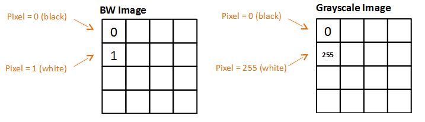
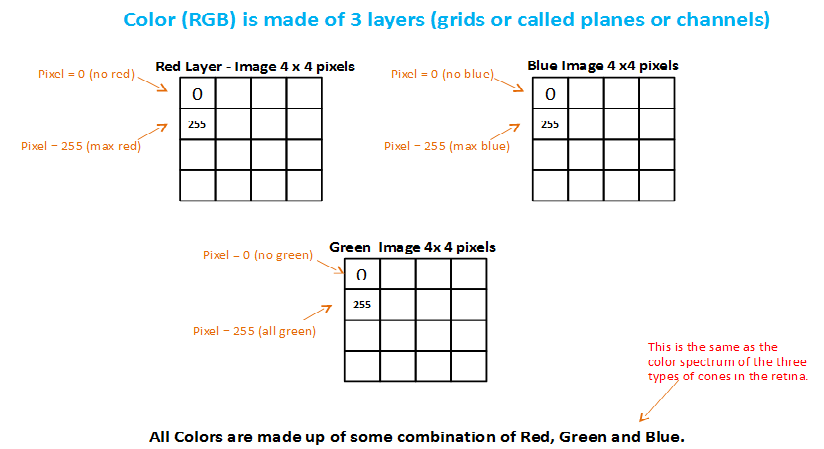

# Computer Vision

## Introduction

Welcome to the labs.earth collaborative laboratory tutorials on machine learning. 

The computer vision (CV) tutorials will start with the basics and progress to advanced real world applications. The tutorials go beyond explaining the code and steps, to include the answers to the anticipated what and why questions.

Before the advent of machine learning with computer vision and today's modern ML/CV frameworks, working with and building real world applications was once the exclusive domain of imaging scientists. The **Gap** framework extends modern computer vision to software developers, whom are familar with object oriented programming (OOP), object relational models (ORM), design patterns (e.g., MVC), asynchronous programming (AJAX), and microservice architectures.

For the data analyst and statisticians whom feel they don't have the necessary software development background, we encourage you to visit the collaborative lab's training site for fundamentials in modern software programming. Likewise, for those software developers whom feel they don't have the necessary background in statistics and machine learning, we encourage you to visit the collaborative lab's training site for fundamentials in [modern statistics and machine learning](https://github.com/andrewferlitsch/Training/tree/master/AITraining/Fundamentals/Machine%20Learning).

As far as our team and contributers, they keep a single phrase in mind when designing, coding and building tutorials. They like to say that **Gap** is:

                                            Machine Learning for Humans

## The First Steps in using Gap for Computer Vision (CV)

The first step in using **Gap** for machine learning (ML) of computer vision (CV) is learning to classify a single object in an image. Is it a dog, a cat, what digit is it, what sign language digit is it, etc...

To do single object classification, depending on the images, one will use either a artificial neural network 
([ANN](https://github.com/andrewferlitsch/Training/blob/master/AITraining/Fundamentals/Machine%20Learning/ML%20Neural%20Networks.pptx)) 
or a convolutional neural network ([CNN](https://github.com/andrewferlitsch/Training/blob/master/AITraining/Fundamentals/Machine%20Learning/ML%20Convolutional%20Neural%20Networks.pptx)).

In either case, the raw pixel data is not directly inputted into a neural network. Instead, it has to be prepared into machine learning (ML) ready data. How it is prepared/transformed is dependent on the image source, the type and configuration of the
neural network, and the target application.

Images can come from a variety of sources, such as by your cell phone, images found on the Internet, a [facsimile image (FAX)](https://en.wikipedia.org/wiki/TIFF), a [video frame from a video stream](https://en.wikipedia.org/wiki/Film_frame#Video_frames), a [digitized medical/dental x-ray](https://en.wikipedia.org/wiki/Digital_radiography), a [magnetic resonance imaging (MRI)](https://en.wikipedia.org/wiki/Magnetic_resonance_imaging), a [electron microscopy (TEM)](https://en.wikipedia.org/wiki/Transmission_electron_microscopy), etc. 

Images go from very basic like [1-bit BW single channel (color plane)](https://en.wikipedia.org/wiki/Binary_image), to [8-bit gray scale single channel](https://en.wikipedia.org/wiki/Grayscale), to [8-bit color three channel (RGB)](https://en.wikipedia.org/wiki/8-bit_color), to [8-bit color four channel (+alpha channel)](https://en.wikipedia.org/wiki/Alpha_compositing), to [16-bit high tone (CMYK)](https://en.wikipedia.org/wiki/CMYK_color_model), to [infrared](https://en.wikipedia.org/wiki/Infrared_photography), to [stereoscopic images (3D)](https://en.wikipedia.org/wiki/Stereoscopy), [sound navigation and ranging (SONAR)](https://en.wikipedia.org/wiki/Sonar), to [RADAR](https://en.wikipedia.org/wiki/Radar), and more.

  

  

### Fundamentals in Preparing an Image for Machine Learning

Neural networks take as input numbers, specifically numbers that are continous real numbers and have been [normalized](https://en.wikipedia.org/wiki/Normalization_(statistics)). For images, pixel values are proportionally squashed between 0 and 1. For ANN networks, the inputs need to be a 1D vector, in which case the input data needs to be flatten, while in a CNN, the input is a 2D vector. Neural networks for computer vision take input of fixed sizes, so there is a transformation step to transform the pixel data to the input size and shape of the neural network, and finally assigning a label to the image (e.g., it's a cat). Again, for labels, neural networks use integer numbers; for example a cat must be assigned to a unique integer value and a dog to a different unique integer value. 

These are the basic steps for all computer vision based neural networks:

  - Transformation
  - Normalization
  - Shaping (e.g., flattening)
  - Labeling
  
### Importing Vision module
 
The **Vision** module of the **Gap** framework implements the classes and methods for computer vision. Within the [Vision](https://github.com/andrewferlitsch/Gap/blob/master/vision.py) module are two primary class objects for data management of images. The `Image` class manages individual images, while the `Images` class manages collections of images. As a first step, in your Python script or program you want to import from the `Vision` module the `Image` and `Images` class objects.

```python
from vision import Image, Images
```
 
### Preprocessing (Preparing) an image with Gap
  
Relative to the location of this tutorial are a number of test images used in verifying releases of Gap. For the purpose of these tutorials, the images that are part of the Gap release verification will be used for examples. The test file `1_100.jpg` is a simple 100x100 96 dpi color image (RGB/8bit) from the Kaggle Fruit360 dataset. This dataset was part of a Kaggle contents to classify different types of fruits and their variety. It was a fairly simple dataset in that all the images were of the same size, type and number of channels. Further, each image contained only the object to classify (i.e., fruit) and was centered in the image.

The first step is to instantiate an `Image` class object and load the image into it, and its corresponding label. In the example below, an `Image` object is created where the first two positional parameters are the path to the image and the corresponding label (i.e., 1). 

```python
image = Image("../tests/files/1_100.jpg", 1)
```

While Python does not have OOP polymorphism builtin, the class objects in **Gap** have been constructed to emulate polymorphism in a variety of ways. The first positional parameter (image path) to the `Image` class can either be a local path or a remote path. In the latter case, a path starting with http or https is a remote path. In this case, a HTTP request to fetch the image from the remote location is made.

```python
image = Image("https://en.wikipedia.org/wiki/File:Example.jpg", 1)
```

Alternately, raw pixel data can be specified as the first (image) positional parameter, as a numpy array.

```python
raw = cv2.imread("../tests/files/1_100.jpg")
image = Image(raw, 1)
```

Preprocessing of the image in the above examples is synchronous. The initializer (i.e., constructor) returns an image object once the image file has been preprocessed. Alternately, preprocessing of an image can be done asynchronously, where the preprocessing is performed by a background thread. Asynchronous processing occurs if the keyword parameter `ehandler` is specified. The value of the parameter is set to a function or method, which is invoked with the image object as a parameter when preprocessing of the image is complete.

```python
image = Image("../tests/files/1_100.jpg", 1, ehandler=myfunc)

def myfunc(image):
    print("done")
```

The `Image` class has a number of attributes which are accessed using OOP properties (i.e., getters and setters). The attributes below provide information on the source image:

```python
print(image.name)   # the name of the image (e.g., 1_100)
print(image.type)   # the type of the image (e.g., jpg)
print(image.size)   # the size of the image in bytes (e.g., 3574)
print(image.label)  # the label assigned to the image (e.g., 1)
```

The raw pixel data of the source image is accessed with the `raw` property, where property returns the uncompressed pixel data of the source image as a numpy array.

```python
raw = image.raw
print(type(raw))    # outputs <class 'numpy.ndarry'>
print(raw.shape)    # outputs the shape of the source image (e.g., (100, 100, 3))
```

The preprocessed machine learning ready data is accessed with the `data` property, where the property returns the data as a numpy array.

```python
data = image.data
print(type(data))   # outputs <class 'numpy.ndarry'>
print(data.shape)   # outputs the shape of the machine learning data (e.g., (100, 100, 3))
```

By default, the shape and number of channels of the source image are maintained in the preprocessed machine learning ready data, and the pixel values are normalized to values between 0 and 1. 

```python
print(raw[0][80])   # outputs pixel values (e.g., [250, 255, 255])
print(data[0][80])  # outputs machine learning ready data values (e.g., [0.98039216, 1.0, 1.0])
```

When processing of the image is completed, the raw pixel data, machine learning ready data, and attributes are stored in a HDF5 (Hierarchical Data Format) formatted file. By default, the file is stored in the current local directory, where the rootname of the file is the rootname of the image. Storage provides the means to latter retrieval the machine learning ready data for feeding into a neural network, and/or retransforming the machine learning ready data. In the above example, the file would be stored as:

`./1_100.hd5`

The path location of the stored HDF5 can be specified with the keyword parameter `dir`.

```python
image = Image("../tests/files/1_100.jpg", 1, dir="tmp")
```

In the above example, the HDF5 file will be stored under the subdirectory `tmp`. If the subdirectory path does not exist, the `Image` object will attempt to create the folder.

The `Image` class optionally takes the keyword parameter `config`. This parameter takes a list of one or more settings, which alter how the image is preprocessed. For example, one can choose to use disable storing the HDF5 file using the keyword parameter `config` with the setting `nostore`.

```python
image = Image("../tests/files/1_100.jpg", 1, config=['nostore'])
```

### Example: Cloud-based Image Processing Pipeline

For a real-world example, let's assume one is developing a cloud based system that takes images uploaded from users, with the following requirements.

+ Handles multiple users uploading at the same time.
+ Preprocessing of the images is concurrent.
+ The machine learning ready data is passed to another step in a data (e.g., workflow) pipeline.
  
  Below is a bare-bones implementation.

```python
def first_step(uploaded_image, label):
    """ Preprocess an uploaded image w/label concurrently and then pass the preprocessed machine learning 
        ready data to another step in a data pipeline.
    """
    image = Image(uploaded_image, label, ehandler=next_step, config=['nostore'])

def next_step(step):
    """ Do something with the Image object as the next step in the data pipeline """
    data = image.data
```

### Preprocessing Transformations: Resizing, Reshaping, Flattening

The keyword parameter `config` has a number of settings for specifying how the raw pixel data is preprocessed. The **Gap** framework is designed to eliminate the use of large numbers of keyword parameters, and instead uses a modern convention of passing in a configuration parameter. Here are some of the configuration settings:

>     nostore                 # do not store in a HDF5 file
>     grayscale | gray        # convert to a grayscale image with a single channel (i.e., color plane)
>     flatten   | flat        # flatten the machine learning ready data into a 1D vector
>     resize=(height, width)  # resize the raw pixel data
>     thumb=(height, width)   # create (and store) a thumbnail of the raw pixel data
        
Let's look how you can use these settings for something like neural network's equivalent of the hello world example ~ [training the MNIST dataset](https://www.tensorflow.org/versions/r1.0/get_started/mnist/beginners). The MNIST dataset consists of 28x28 grayscale images. Do to its size, grayscale and simplicity, it can be trained with just a ANN (vs. CNN). Since ANN take as input a 1D vector, the machine learning ready data would need to be reshaped (i.e., flatten) into a 1D vector.

```python
# An example of how one might use the Image object to preprocess an image from the MNIST dataset for a ANN
image = Image("mnist_example.jpg", digit, config=["gray", "flatten"])

print(image.shape)  # would output (784,)
```

In the above, the preprocessed machine learning ready data will be in a vector of size 784 (i.e., 28x28) with data type float. 

Let's look at another publicly accessible training set, the Fruits360 Kaggle competition. In this training set, the images are 100x100 RGB images (i.e., 3 channels). If one used a CNN for this training set, one would preserve the number of channels. But the input vector may be unneccessarily large for training purposes (30000 ~ 100x100x3). Let's reduce the size using the resize setting by 1/4.

```python
image = Image("../tests/files/1_100.jpg", config=['resize=(50,50)'])

print(image.shape)  # would output (50, 50, 3)
```

### Example: Image Processing Dashboard

Let's expand on the real-word cloud example from earlier. In this case, let's assume that one wants to have a dashboard for a DevOps person to monitor the preprocessing of images from a user, with the requirements:

+ Each time an image is preprocessed, the following is displayed on the dashboard:
    - A thumbnail of the source image.
    - The amount of time to preprocess the image.
    - Progress count of number of images preprocessed and accumulated time.
    
Here's the updated code:

```python
def first_step(uploaded_image, label):
    """ Preprocess an uploaded image w/label concurrently and then pass the preprocessed machine learning 
        ready data to another step in a data pipeline.
    """
    image = Image(uploaded_image, label, ehandler=second_step, config=['nostore', 'thumb=(16,16)'])

nimages = 0
nsecs   = 0

def second_step(image):
    """ Display progress in dashboard """
    # Progress Accumulation
    nimages += 1
    nsecs += image.time

    # Construct message and pass thumbnail and msg to the dashboard
    msg = "Time %d, Number: %d, Accumulated: %f" % (time.time, nimages, nsecs)
    dashboard.display(img=image.thumb, text=msg)

    # The next processing step ...
    third_step(image)
```

Okay, there is still some problem with this example in that `nimages` and `nsecs` are global and would be trashed by concurrent processing of different users. The `ehandler` parameter can be passed a tuple instead of a single value. In this case, the `Image` object emulates polymorphism. When specified as a tuple, the first item in the tuple is the event handler and the remaining items are additional arguments to the event handler. Let's now solve the above problem by adding a new object `user` which is passed to the first function `first_step()`. The `user` object will have fields for accumulating the number of times an image was processed for the user and the accumulated time. The `ehandler` parameter is then modified to pass the `user` object to the event handler `second_step()`.

```python
def first_step(uploaded_image, label, user):
    """ Preprocess an uploaded image w/label concurrently and then pass the preprocessed machine learning 
        ready data to another step in a data pipeline.
    """
    image = Image(uploaded_image, label, ehandler=(second_step, user), config=['nostore', 'thumb=(16,16)'])

def second_step(image, user):
    """ Display progress in dashboard """
    # Progress Accumulation
    user.nimages += 1
    user.nsecs += image.time

    # Construct message and pass thumbnail and msg to the dashboard
    msg = "Time %d, Number: %d, Accumulated: %f" % (time.time, nimages, nsecs)
    dashboard.display(img=image.thumb, text=msg)

    # The next processing step ...
    third_step(image, user)
```

### Image Retrieval

By default, the `Image` class will store the generated HDF5 in the current working directory (i.e., ./). The keyword parameter `dir` tells the `Image` class where to store the generated HDF5 file.

```python
image = Image("../tests/files/1_100.jpg", dir='tmp')  # stored as tmp/1_100.h5
```

Once stored, the `Image` object subsequently can be retrieved (i.e., reused) from the HDF5 file. In the example below, an empty `Image` object is first instantiated, and then the method `load()` is invoked passing it the name (rootname) of the image and the directory where the HDF5 file is stored, if not in the current working directory.

```python
image = Image()
image.load('1_100', dir='tmp')

# retrieve the machine learning ready data from the loaded Image object
data = image.data
```

### Image Reference

For a complete reference on all methods and properties for the `Image` class, see [reference](https://virtualdvid.github.io/Gap/modules/vision_spec/).

### Image Collections
   
The `Images` class provides preprocessing of a collections of images (vs. a single image). The parameters and emulated polymorphism are identical to the `Image` class, except the images and labels parameter refer to a plurality of images, which comprise the collection. The positional parameter `images` can be specified as:

 + A list of local or remote images (e.g., [ '1_100.jpg', '2_100.jpg', '3_100.jpg'])
 + A single directory path of images  (e.g., 'apple')
 + A list of directory paths of images (e.g., ['apple', 'pear', 'banana'])
  
The corresponding positional parameter `labels` must match the number of images as follows:

 + A single value, applies to all the images (e.g., 1)
 + A list of values which are the same length as the list of images or directory paths (e.g., [1, 2, 3]).
  
The example below creates an `Images` objects consisting of three images with corresponding labels 1, 2 and 3.

```python
images = Images(['1_100.jpg', '2_100.jpg', '3_100.jpg'], [1, 2, 3])
```

For each image specified, the `Images` class creates an `Image` object, which are maintained in the `images` objects as a list. The list of corresonding `Image` objects can be accessed from the property `images`. In the example below, a collection of three images is created, and then the `images` property is accessed as a list iterator in a for loop. On each loop, the next `Image` object is accessed and inside the loop the code prints the name and label of the corresponding `Image` object.

```python
images = Images(['1_100.jpg', '2_100.jpg', '3_100.jpg'], [1, 2, 3])
for image in images.images:
    print(image.name, image.label)
```
will output:
```
1_100 1
2_100 2
3_100 3
```

The builtin operators `len()` and `[]` are overridden in the `Images` class. The `len()` operator will return the number of images, and the list (array) index operator `[]` will return the `Image` object at the corresponding index. Using the builtin operators, the above example can be alternately coded as:

```python
        for i in range(len(images)):
            print(images[i].name, images[i].label)
```

### Collection Storage & Retrieval

The `Images` class, disables the `Image` objects from storing the machine learning ready data as individual HDF5 files per image, and insteads stores a single HDF5 for the entire collection. By default, the file name combines the prefix `collection.` with the root name of the first image in the collection, and is stored in the current working directory. In the above example, the machine learning ready data for the entire collection would be stored as:

`./collection.1_100.h5`
        
The directory where the HDF5 file is stored can be changed with the keyword paramater `dir`, and the root name of the file can be set with the keyword parameter `name`.

```python
images = Images(['1_100.jpg', '2_100.jpg', '3_100.jpg'], [1, 2, 3], dir='tmp', name='apples')
```

In the above example, the machine learning ready data is stored as:

`./tmp/apples.h5`
        
A stored collection can the be subsequently retrieved from storage by instantiating an empty `Images` object and invoking the `load()` method with the corresponding collection name. For the above example, the apples collection would be retrieved and `Images` and corresponding `Image` objects reconstructed in memory:

```python
# Instantiate an empty Images object
images = Images()

# Set the directory where the collection is
images.dir = 'tmp'

# Load the collection into memory
images.load('apples')
```

Alternately, the `load()` method can be passed the keyword parameter `dir` to specify the directory where the collection is stored. For the above, this can be specified as:

```python
images.load('apples', dir='tmp')
```        
 
### Example: Data Preparation for a Fruits Dataset: As Individual Collections
 
In this example, a dataset of images of fruit are preprocessed into machine learning ready data, as follows:

  1. The images for each type of fruit are in separate directories (i.e., apple, pear, banana).
  2. The labels for the fruit will are sequentially numbered (i.e., 1, 2, 3).
  3. The images will be preserved as color images, but resized to (50,50).
  4. The shape of the preprocessed machine learning data will be (50, 50, 3) for input to a CNN.
  
In the example below, a separate collection is created for each type of fruit:

```python
        apples   = Images( 'apple',  1, name='apples',  config=['resize=(50,50)'] )
        pears    = Images( 'pear' ,  2, name='pears',   config=['resize=(50,50)'] )
        bananas  = Images( 'banana', 3, name='bananas', config=['resize=(50,50)'] )
```

In the above example, the machine learning ready data is stored as:

```
./apples.h5
./pears.h5
./bananas.h5
```

In the above example, the preprocessing of each type of fruit was sequentially. Since conventional CPUs today are multi-core, we can take advantage of concurrency and speed up the processing in many computers by using the keyword parameter `ehandler` to process each collection asynchronously in parallel.

```python
accumulated = 0

label = 1
for fruit in ['apple', 'pear', 'banana']:
    Images( fruit, label, name=fruit + 's', config=['resize=(50,50)'], ehandler=collectionHandler )
    label += 1

def collectionHandler(images):
    accumulated += images.time
    print("Number of Images:", len(images), "Time:", images.time)
```

Let's describe some of the aspects of the above example. For the directories, we created a list of the directory names and then iterated through it. For each iteration, we:

+ Instantiate an `Images` object for the current fruit.
+ Set the collection name to the plural of the fruit name (i.e., fruit + 's').
+ Use an incrementer, starting at 1, for the label.
+ Use the `ehandler` parameter to process the collection asynchronously.
  
When each collection is completed, the function collectionHandler is called. This function will print the number of images
processed in the collection, the time (in seconds) to process the collection, and the accumulated processing time for all the collections.

### Example: Data Preparation for a Fruits Dataset: As a Combined Collection

Alternatively, we can process a group of collections as a single combined collection. The example below does the same as the aforementioned example, but produces a single (combined) dataset (vs. three individual datasets).

```python
fruits = Images( ['apples', 'pears', 'bananas'], [1, 2, 3], name='fruits', config=['resize=(50,50)'] )
```

In the above example, the machine learning ready data is stored as:

`./fruits.h5`
        
Can we improve on the above? We got the benefit of a combined collection, but lost the benefit of concurrently preprocessing each collection. That's not overlooked. The `+=` operator for the `Images` collection is overridden to combine collections. Let's update the earlier example to preprocess each collection asynchronously and combine them into a single collection.

```python
dataset = None
accumulated = 0
lock = Lock()

label = 1
for fruit in ['apple', 'pear', 'banana']:
    Images( fruit, label, name=fruit + 's', config=['resize=(50,50)'], ehandler=collectionHandler )
    label += 1

def collectionHandler(images):
    accumulated += images.time
    print("Number of Images:", len(images), "Time:", images.time)

    # these steps need to be atomic
    lock.acquire()
    if dataset is None:
        dataset = images
    else:
        dataset += images
    lock.release()
```

In the above example, we used the variable dataset for the combined collection. After the first collection is preprocessed, we set the variable dataset to the first `Images` object, and afterwards we combine it with subsequent collections using the `+=` operator.

Because the processing and invoking the event handler happen concurrently, there are possible problems including a race condition (i.e., two threads access dataset at the same time), and trashing the internal data (i.e., two threads are combining data at the same time). We solve this by making this operation atomic using Python's thread lock mechanism.

*Above feature anticipated for v0.9.5 (beta)
 
### Splitting the Collection into Training and Test Data

The first step to training a neural network is to split the collection into training and test data. We will cover some basic cases here.

One uses the property `split` as a setter to split the collection into training and test data. This property will randomized the order of the `Image` objects in the collection, create a partition between the train and test data and create a corresponding internal index. The `split` property is implemented using emulated polymorphism, whereby the property can be given a single value or a tuple. The first value (parameter) is the percentage of the collection that will be set aside as testing data, and must be between 0 and 1. Below is an example:

```python
# 20% of the collection is test, and 80% is training
images.split = 0.2
```

In another case, one might have separate collections for train and test. In this case, for both collections set the split to 0, which means use the entire collection, but otherwises randomizes the order of the `Image` objects.

```python
train = Images( ['train/apple', 'train/pear', 'train/banana'], [1, 2, 3], config=['resize=(50,50)'])
test  = Images( ['test/apple',  'test/pear',  'test/banana'],  [1, 2, 3], config=['resize=(50,50)'])
train.split = 0
test.split  = 0
```

The random number generation by default will start at a different seed each time. If you need (desire) consistency between training on the results for comparison or demo'ing, then one specifies a seed value for the random number generation. The seed value is an integer value and is specified as a second parameter (i.e., tuple) to the `split` property. In the example below, the split is set to 20% test, and the random seed set to 42.

`images.split = 0.2, 42`

One can see the index of the randomized distribution by displaying the internal member `_train`. This member is a list of integers which correspond to the index in the `images` list. While Python does not support the OOP concept of data encapsulation using private members, the **Gap** framework follows the convention that any member beginning with an underscore should be treated by developers as private. While not enforced by Python, members like `_train` should only be read and not written. The example below accesses (read) the randomized index for the training data and then prints it.

```python
indexes = images._train
print(indexes)
```

### Forward Feeding a Neural Network

The `Images` class provides methods for batch, stochastic and mini-batch feeding for training and evaluating a neural network. The feeders produce full batch samples, single samples and mini-batch samples as numpy matrixes, which are compatible for input with all Python machine learning frameworks that support numpy arrays, such as Tensorflow, Keras and Pytorch, for example. Forward feeding is randomized, and the entire collection(s) can be continuously re-feed (i.e., epoch), where each time they are re-randomized.

The `split`, `minibatch`, and overriden `next()` operator support forward feeding. 

#### Batch Feeding

In batch mode, the entire training set can be ran through the neural network as a single pass, prior to backward probagation and updating the weights using gradient descent. This is known as 'batch gradient descent'.

When the `split` property is used as a getter, it returns the image data and corresponding labels for the training and test set similar to using sci-learn's train_test_split() function. In the example below:

+ The dataset is split into 20% test and 80% training.
+ The X_train and X_test is the list of machine learning ready data, as numpy arrays, of the corresponding training and test images.
+ The Y_train and Y_test is the list of the corresponding labels.
+ The variable epochs is the number of times the X_train dataset will be forward feed through the neural network.
+ The optimizer performs backward probagation to update the weights.
+ At the end of each epoch, The training data is re-randomized by calling the `split` method again as a getter.
+ When training is done, the X_test and corresponding Y_test are forward feed to evaluate the accuracy of the trained model.


```python
# Get the first randomized split of the dataset
images.split = 0.2, 42
X_train, X_test, Y_train, Y_test = images.split

nepochs = 200   # the number of times to feed the entire training set while training the neural network
for _ in range(nepochs):
    # feed the entire training set per epoch (i.e., X_train, Y_train)
    pass

    # run the optimizer (backward probagation) to update the weights
    pass

    # Re-randomize the training set
    X_train, _, Y_train, _ = images.split

# feed the entire text data and calculate accuracy (i.e., X_test, Y_test)
pass
```

#### Stochastic Feeding


            
*in progress*
            
### Data Augmentation

### Transformation
        
 *fix it: label should be labels*
