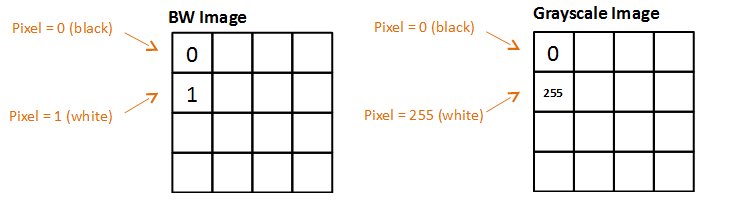

# Tutorials (Computer Vision)

## Introduction

Welcome to the labs.earth collaborative laboratory tutorials on machine learning. 

The computer vision (CV) tutorials will start with the basics and progress to advanced real world applications. The tutorials go beyond explaining the code and steps, to include the answers to the anticipated what and why questions.

Before the advent of machine learning with computer vision and today's modern ML/CV frameworks, working with and building real world applications was once the exclusive domain of imaging scientists. The Gap framework extends modern computer vision to software developers, whom are familar with object oriented programming (OOP), object relational models (ORM), design patterns (e.g., MVC), asynchronous programming (AJAX), and microservice architectures.

For the data analyst and statisticians whom feel they don't have the necessary software development background, we encourage you to visit the collaborative lab's training site for fundamentials in modern software programming. Likewise, for those software developers whom feel they don't have the necessary background in statistics and machine learning, we encourage you to visit the collaborative lab's training site for fundamentials in [modern statistics and machine learning](https://github.com/andrewferlitsch/Training/tree/master/AITraining/Fundamentals/Machine%20Learning).

As far as our team and contributers, they keep a single phrase in mind when designing, coding and building tutorials. They like to say that Gap is:

                                            Machine Learning for Humans

## The First Steps in using Gap for Computer Vision (CV)

The first step in using Gap for machine learning (ML) of computer vision (CV) is learning to classify a single object in an image.
Is it a dog, a cat, what digit is it, what sign language digit is it, etc...

To do single object classification, depending on the images, one will use either a artificial neural network 
([ANN](https://github.com/andrewferlitsch/Training/blob/master/AITraining/Fundamentals/Machine%20Learning/ML%20Neural%20Networks.pptx)) 
or a convolutional neural network ([CNN](https://github.com/andrewferlitsch/Training/blob/master/AITraining/Fundamentals/Machine%20Learning/ML%20Convolutional%20Neural%20Networks.pptx)).

In either case, the raw pixel data is not directly inputted into a neural network. Instead, it has to be prepared into machine learning (ML) ready data. How it is prepared/transformed is dependent on the image source, the type and configuration of the
neural network, and the target application.

Images can come from a variety of sources, such as by your cell phone, images found on the Internet, a [facsimile image (FAX)](https://en.wikipedia.org/wiki/TIFF), a [video frame from a video stream](https://en.wikipedia.org/wiki/Film_frame#Video_frames), a [digitized medical/dental x-ray](https://en.wikipedia.org/wiki/Digital_radiography), a [magnetic resonance imaging (MRI)](https://en.wikipedia.org/wiki/Magnetic_resonance_imaging), a [electron microscopy (TEM)](https://en.wikipedia.org/wiki/Transmission_electron_microscopy), etc. 

Images go from very basic like [1-bit BW single channel (color plane)](https://en.wikipedia.org/wiki/Binary_image), to [8-bit gray scale single channel](https://en.wikipedia.org/wiki/Grayscale), to [8-bit color three channel (RGB)](https://en.wikipedia.org/wiki/8-bit_color), to [8-bit color four channel (+alpha channel)](https://en.wikipedia.org/wiki/Alpha_compositing), to [16-bit high tone (CMYK)](https://en.wikipedia.org/wiki/CMYK_color_model), to [infrared](https://en.wikipedia.org/wiki/Infrared_photography), to [stereoscopic images (3D)](https://en.wikipedia.org/wiki/Stereoscopy), [sound navigation and ranging (SONAR)](https://en.wikipedia.org/wiki/Sonar), to [RADAR](https://en.wikipedia.org/wiki/Radar), and more.

### Fundamentals in Preparing an Image for Machine Learning

Neural networks take as input numbers, specifically numbers that are continous real numbers and have been [normalized](https://en.wikipedia.org/wiki/Normalization_(statistics)). For images, pixel values are proportionally squashed between 0 and 1. For ANN networks, the inputs need to be a 1D vector, in which case the input data needs to be flatten, while in a CNN, the input is a 2D vector. Neural networks for computer vision take input of fixed sizes, so there is a transformation step to transform the pixel data to the input size and shape of the neural network, and finally assigning a label to the image (e.g., it's a cat). Again, for labels, neural networks use integer numbers; for example a cat must be assigned to a unique integer value and a dog to a different unique integer value. 

These are the basic steps for all computer vision based neural networks:

  - Transformation
  - Normalization
  - Shaping (e.g., flattening)
  - Labeling
  
 ### Importing Vision module
 
The Vision module of the Gap framework implements the classes and methods for computer vision. Within the [Vision](https://github.com/andrewferlitsch/Gap/blob/master/vision.py) module are two primary class objects for data management of images. The Image class manages individual images, while the Images class manages collections of images. As a first step, in your Python script or program you want to import from the Vision module the Image and Images class objects.

      from vision import Image, Images
 
 ### Preprocessing (Preparing) an image with Gap
  
Relative to the location of this tutorial are a number of test images used in verifying releases of Gap. For the purpose of these tutorials, the images that are part of the Gap release verification will be used for examples. The test file 1_100.jpg is a simple 100x100 96 dpi color image (RGB/8bit) from the Kaggle Fruit360 dataset. This dataset was part of a Kaggle contents to classify different types of fruits and their variety. It was a fairly simple dataset in that all the images were of the same size, type and number of channels. Further, each image contained only the object to classify (i.e., fruit) and was centered in the image.

The first step is to instantiate an Image class object and load the image into it, and its corresponding label. In the example below, an Image object is created where the first two positional parameters are the path to the image and the corresponding label (i.e., 1). 
  
      image = Image("../tests/files/1_100.jpg", 1)

While Python does not have OOP polymorphism builtin, the class objects in Gap have been constructed to emulate polymorphism in a variety of ways. The first positional parameter (image path) to the Image class can either be a local path or a remote path. In the latter case, a path starting with http or https is a remote path. In this case, a HTTP request to fetch the image from the remote location is made.

      image = Image("https://en.wikipedia.org/wiki/File:Example.jpg", 1)

Preprocessing of the image in the above examples is synchronous. The initializer (i.e., constructor) returns an image object once the image file has been preprocessed. Alternately, preprocessing of an image can be done asynchronously, where the preprocessing is performed by a background thread. Asynchronous processing occurs if the keyword parameter *ehandler* is specified. The value of the parameter is set to a function or method, which is invoked with the image object as a parameter when preprocessing of the image is complete.
  
      image = Image("../tests/files/1_100.jpg", 1, ehandler=myfunc)
      
      def myfunc(image):
        print("done")

The Image class has a number of attributes which are accessed using OOP properties (i.e., getters and setters). The attributes below provide information on the source image:

      print(image.name)   # the name of the image (e.g., 1_100)
      print(image.type)   # the type of the image (e.g., jpg)
      print(image.size)   # the size of the image in bytes (e.g., 3574)
      print(image.label)  # the label assigned to the image (e.g., 1)
      
The raw pixel data of the source image is accessed with the *raw* property, where property returns the uncompressed pixel data of the source image as a numpy array.

      raw = image.raw
      print(type(raw))    # outputs <class 'numpy.ndarry'>
      print(raw.shape)    # outputs the shape of the source image (e.g., (100, 100, 3))

The preprocessed machine learning ready data is accessed with the *data* property, where the property returns the data as a numpy array.

      data = image.data
      print(type(data))   # outputs <class 'numpy.ndarry'>
      print(data.shape)   # outputs the shape of the machine learning data (e.g., (100, 100, 3))
      
By default, the shape and number of channels of the source image are maintained in the preprocessed machine learning ready data, and the pixel values are normalized to values between 0 and 1. 

      print(raw[0][80])   # outputs pixel values (e.g., [250, 255, 255])
      print(data[0][80])  # outputs machine learning ready data values (e.g., [0.98039216, 1.0, 1.0])

When processing of the image is completed, the raw pixel data, machine learning ready data, and attributes are stored in a HDF5 (Hierarchical Data Format) formatted file. By default, the file is stored in the current local directory, where the rootname of the file is the rootname of the image. Storage provides the means to latter retrieval the machine learning ready data for feeding into a neural network, and/or retransforming the machine learning ready data. In the above example, the file would be stored as:

      ./1_100.hd5
      
The path location of the stored HDF5 can be specified with the keyword parameter *dir*.

      image = Image("../tests/files/1_100.jpg", 1, dir="something")
    
<config nostore>
<example>
  
<resize>
